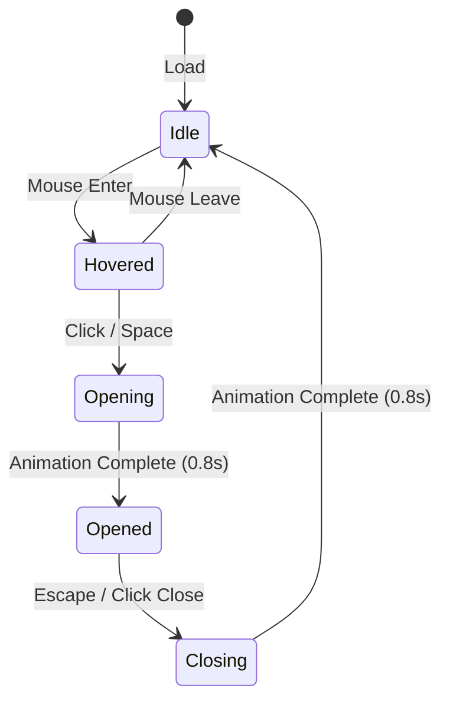
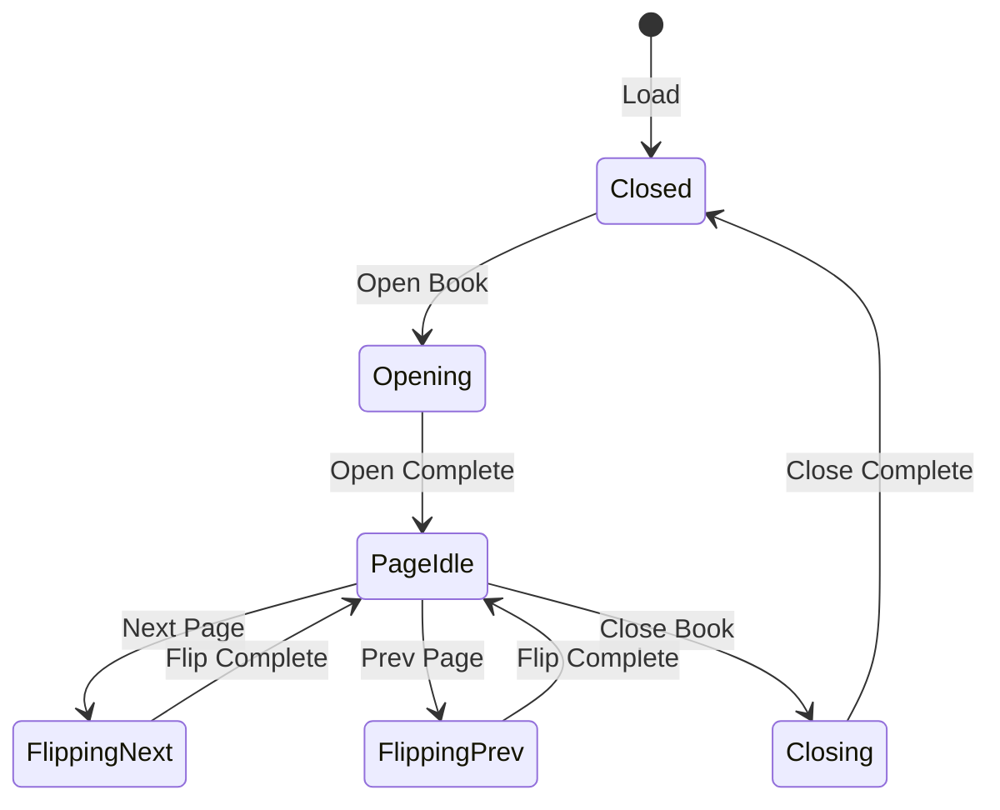

# DIGITAL MEMORIES — COMPONENT SPECIFICATIONS DETAIL
Version 1.0

---

## 1. LETTER OBJECT SPECIFICATION

### 1.1. Visual Diagram & Component Tree
```
[Envelope Container (Perspective: 1200px)]
   ├── [Envelope Back Flap (Base Shadow)]
   ├── [Letter Sheet (Caveat Font, Overflow Scroll)]
   └── [Envelope Front Flap & Wax Seal (rotateX)]
```

### 1.2. State Machine (Letter States)


### 1.3. Animation Timeline (Cinematic Sequence)
1. **Time 0.0s**: Wax seal breaks (splits in halves), fades out (`opacity: 0`).
2. **Time 0.2s**: Envelope Lid rotates upward (`rotateX: 0deg` to `rotateX: 180deg`).
3. **Time 0.5s**: Letter sheet slides upward (`translateY(0)` to `translateY(-105%)`) and scales slightly (`scale: 1.05`).
4. **Time 0.8s**: Letter details fade in, scrollbar active.

### 1.4. Props Interface (TypeScript)
```typescript
interface LetterProps {
  greeting: string;
  message: string;
  signOff: string;
  sender: string;
  stampUrl?: string;
  locked?: boolean;
  onOpen?: () => void;
  onClose?: () => void;
}
```

### 1.5. Acceptance Criteria
* The letter must stay perfectly centered regardless of screen zoom or resolution.
* Must support `Escape` key to fold letter back.

---

## 2. BOOK OBJECT SPECIFICATION

### 2.1. Visual Diagram & Component Tree
```
[Book Container]
   ├── [Spine/Center Shadow]
   ├── [Left Page (Curved Surface)]
   └── [Right Page (Curved Surface)]
```

### 2.2. State Machine (Book States)


### 2.3. Props Interface (TypeScript)
```typescript
interface BookPage {
  title: string;
  story: string;
  image?: string;
  date?: string;
}

interface BookProps {
  pages: BookPage[];
  onPageChange?: (index: number) => void;
}
```

### 2.4. Acceptance Criteria
* Turning pages must rotate exactly around the spine (`transform-origin: left` or `right`).
* Must support Keyboard Left/Right arrows to flip pages.
