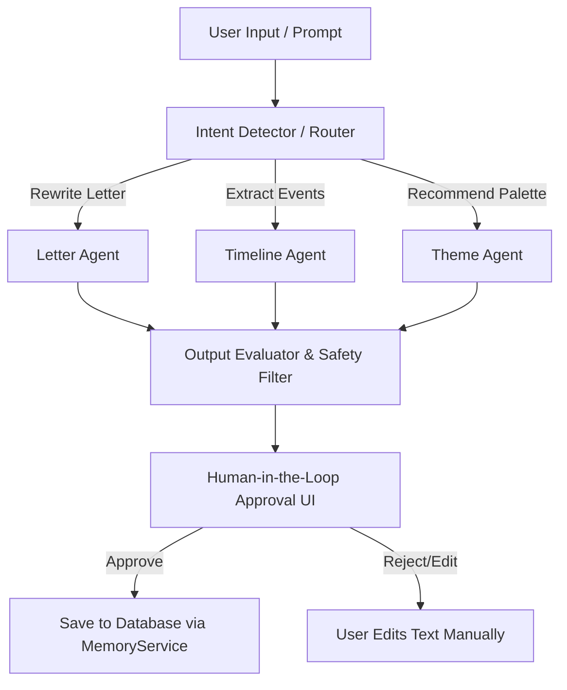

# DIGITAL MEMORIES — AI ORCHESTRATION ARCHITECTURE DETAIL
Version 1.0

---

## 1. AI AGENT REGISTRY & RESPONSIBILITIES

Chúng ta thiết lập mô hình **Multi-Agent Orchestrator** với các vai trò chuyên sâu:

* **Intent Detector (Agent trưởng điều phối)**: Phân tích yêu cầu thô của người dùng, phân loại ý định (intent) và lựa chọn agent phụ trách phù hợp.
* **Letter Agent**: Chuyên xử lý văn bản, điều chỉnh giọng điệu (ấm áp, hoài niệm, lãng mạn) cho Thư tình bí mật và Thư tương lai.
* **Timeline Agent**: Trích xuất ngày tháng, sự kiện, địa điểm từ câu kể thô để sinh ra cấu trúc dòng thời gian chuẩn.
* **Theme Agent**: Đọc cảm xúc chính của kỷ niệm để gợi ý bảng màu, ambient music và style hiển thị.

---

## 2. PROMPT FLOW DIAGRAM



---

## 3. CONTEXT MANAGEMENT & TOKEN OPTIMIZATION

Để tránh việc gửi toàn bộ nhật ký kỷ niệm (gây quá tải token và rò rỉ bảo mật), chúng ta áp dụng chiến lược **Selective Context Injection**:

```
[System Instruction]
       ↓
[Target Event Metadata (Only ID, Title, Date)]
       ↓
[User Prompt Instruction]
       ↓
(Executed by Gemini API)
```
* **Không gửi ảnh/video thô**: Chỉ gửi mô tả alt-text hoặc captions.
* **Cách ly dự án (Project Isolation)**: Mỗi request mang một khóa định danh Project ID duy nhất, cấm tải chéo dữ liệu của Couple khác.

---

## 4. SERVER-SIDE AI SERVICE CONTRACT (TypeScript)

```typescript
export interface AiResponse {
  success: boolean;
  result: string;
  explanation: string; // Giải thích ngắn gọn về thay đổi của AI
}

export interface AiRequest {
  prompt: string;
  type: 'poem' | 'letter' | 'caption';
  projectId: string;
}
```
